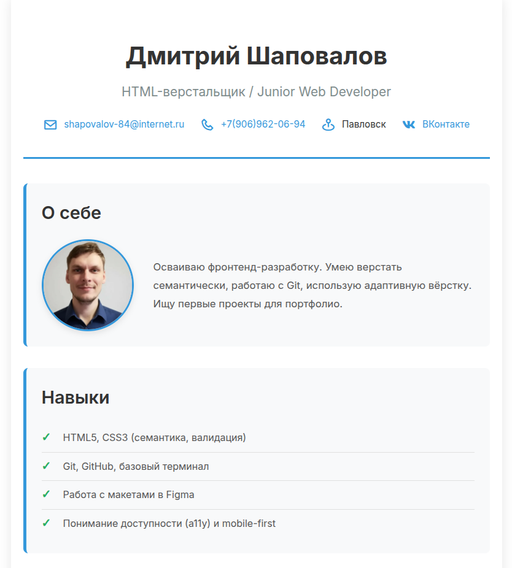
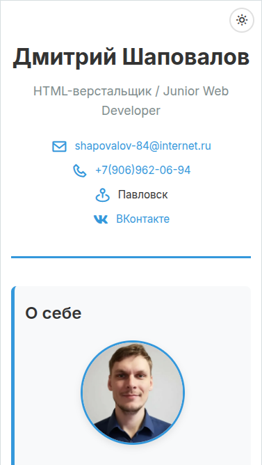

# 👨💻 Дмитрий Шаповалов — Портфолио веб-разработчика

> Семантическая вёрстка, адаптивный дизайн, доступность (a11y), чистый CSS/JS.

## Демо

🔗 [Посмотреть сайт](https://shapovalov-dmitriy.github.io/project-01-resume/)

## 🛠 Стек

- **HTML5**: семантика, ARIA, валидация W3C
- **CSS3**: переменные (`:root`), Flexbox, Grid, `@keyframes`, `prefers-color-scheme`
- **JavaScript**: ES6+, IIFE-модули, `localStorage`, плавный скролл
- **Методология**: БЭМ
- **Инструменты**: Git, GitHub Pages, VS Code, DevTools, Lighthouse

## ✨ Особенности

- ✅ Валидный код (0 ошибок HTML/CSS Validator)
- ✅ Тёмная тема с сохранением выбора в `localStorage`
- ✅ CSS-анимации при загрузке (без JS-нагрузки)
- ✅ Адаптив 320–1920px (mobile-first)
- ✅ Оптимизация: preload шрифтов, WebP, `will-change`
- ✅ Доступность (a11y) и SEO-метатеги (OG, Twitter Card)

## 📁 Структура

├── index.html
├── style.css
├── main.js
├── img/
│ ├── hero-photo.webp
│ ├── certificates/
│ └── screenshot-\*.png
├── favicon.ico
└── README.md

## 📬 Контакты

- 📧 [shapovalov-84@internet.ru](mailto:shapovalov-84@internet.ru)
- 📱 [+7 (906) 962-06-94](tel:+79069620694)
- 💬 [VK](https://vk.com/dimka2484)
- 🌐 [GitHub](https://github.com/Shapovalov-Dmitriy)
